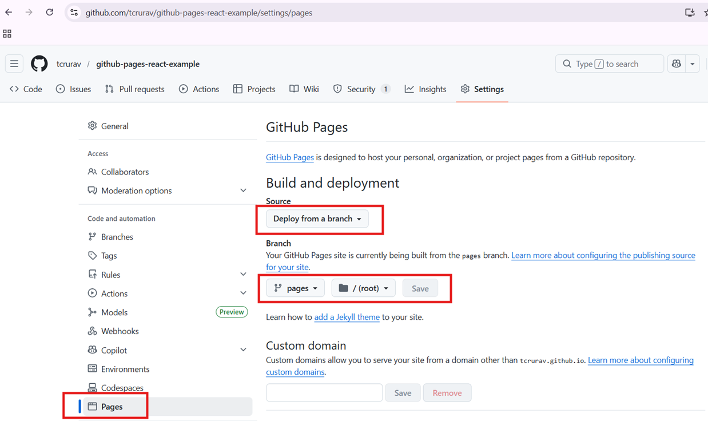

# Upload React Project to Github pages

This project is there as an example on how to upload a dist project to Github pages.

This is the result in [https://tcrurav.github.io/github-pages-react-example/](https://tcrurav.github.io/github-pages-react-example/)


## Prerequisites

You need a working environment with:
* [Git](https://git-scm.com) - You can install it from https://git-scm.com/downloads.
* [Node](https://nodejs.org) - Install node.js from https://nodejs.org/es/download/. It's advisable to install the LTS version.

## General Installation instructions

Clone this project:

```
git clone https://github.com/tcrurav/github-pages-react-example.git
```

Now install all dependencies.

```
cd github-pages-react-example
npm install
```

Run the project to see the resulting page:

```
npm run dev
```

Now create a new repository with your own account and upload this project

```
git remote add my-github-repo https://github.com/your-github-account/your-github-repo
``` 

Now you are ready to do the really important stuff:

1. Create a new branch called pages

````
git checkout -b pages
````

2. edit your ```vite.config.js``` configuration file to have your base directory.

````
import { defineConfig } from 'vite'
import react from '@vitejs/plugin-react'

export default defineConfig({
  plugins: [react()],
  base: '/your-github-repo/', // 👈 your repo name
})
````

3. build your react project.

````
npm run build
````

4. Edit your ```.gitignore``` file and delete the ```dist``` line to allow ```dist``` folder.

5. upload only the ```dist``` folder to the ```pages``` branch of your remote repository.

````
git subtree push --prefix dist your-github-repo pages
````

6. Enable your ```pages``` branch to be deployed on github pages



7. Now you can access your deployed project:
```
https://your-github-account.github.io/your-github-repo
```

Enjoy!!!


## Built With

* [Visual Studio Code](https://code.visualstudio.com/) - The Editor used in this project
* [Vite](https://vite.dev/) - The Build Tool for the Web

## Acknowledgments

* https://gist.github.com/sc1f/12ad9c209a87678b49f4507abf458138. Pushing the contents of your dist folder to gh-pages.
* https://gist.github.com/PurpleBooth/109311bb0361f32d87a2. A very complete template for README.md files.